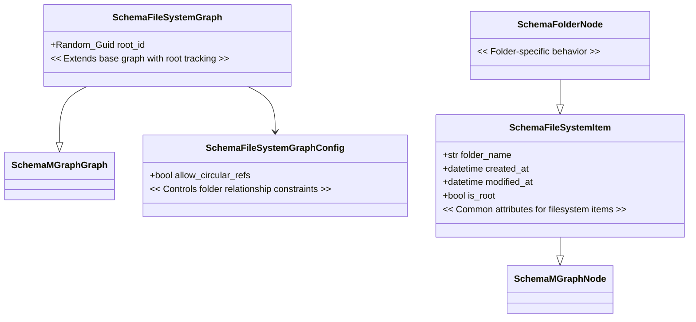

# MGraph FileSystem Implementation

## Overview
We've designed and started implementing a filesystem representation using the MGraph architecture. The implementation focuses on simplicity, leveraging existing MGraph functionality while adding only necessary extensions.

## Key Design Decisions

### 1. Minimal Extension Approach
- Extended base MGraph classes only where necessary
- Leveraged existing edge functionality instead of creating custom types
- Kept data structures flat and simple
- Used attributes for flexibility

### 2. Schema Structure


### 3. Important Architecture Decisions
- Paths are calculated from structure rather than stored
- Root tracking at graph level
- Circular reference control via configuration
- Timestamps in UTC
- Base attributes in Schema__File_System__Item

## Implementation Details

### Core Classes
1. `Schema__File_System__Graph__Config`
   - Controls filesystem behavior
   - Manages circular reference allowance

2. `Schema__File_System__Graph`
   - Tracks root folder
   - Manages overall structure

3. `Schema__File_System__Item`
   - Common filesystem item properties
   - Timestamp management
   - Root status tracking

4. `Schema__Folder__Node`
   - Folder-specific functionality
   - Inherits common filesystem properties

### Key Features
- Automatic timestamp management
- Type-safe implementation
- Flexible attribute system
- Path calculation from structure
- Circular reference prevention

## Next Steps

### Immediate Tasks
1. Implement model layer classes
2. Add validation methods
3. Create helper functions for common operations
4. Develop test cases

### Future Enhancements
1. Add file support
2. Implement search capabilities
3. Add persistence layer
4. Create visualization tools

## Technical Debt/Considerations
- Path calculation performance for deep structures
- Timestamp synchronization in distributed systems
- Edge case handling for circular references
- Performance optimization for large directory structures

## Links to Key Files
- Schema implementations
- Configuration classes
- Core MGraph extensions
- Test suites (to be implemented)

## Usage Example (Planned)
```python
# Create filesystem graph
fs_graph = Schema__File_System__Graph()

# Create root folder
root = Schema__Folder__Node(
    folder_name="/",
    is_root=True
)

# Add folders
docs = Schema__Folder__Node(folder_name="docs")
src = Schema__Folder__Node(folder_name="src")

# Create relationships
fs_graph.add_edge(root.node_id, docs.node_id)
fs_graph.add_edge(root.node_id, src.node_id)
```

## Notes for Next Phase
- Consider implementing file operations
- Plan for permission system
- Think about versioning
- Consider metadata extensions