# MGraph JSON Provider Technical Specification

## Overview

The JSON Provider enables MGraph to ingest, manipulate, and export JSON data structures using MGraph's core graph capabilities. This document outlines the technical approach, architecture, and implementation details.

## Core Concept: A Graph-Native Approach

The JSON Provider implements a pure graph-native approach to JSON representation, where every JSON element becomes a node in its own right. This aligns perfectly with graph thinking and MGraph's core principles.

Key Principles:
- Every JSON element (value, object, array) is a node
- Structure is maintained purely through edges
- Property names are represented as dedicated nodes
- Natural graph traversal and transformation
- Maximum simplicity and flexibility

## Architecture

### Three-Layer Architecture

Following MGraph's architectural principles, the implementation is divided into three clean layers:

```mermaid
classDiagram
    %% Schema Layer
    class Schema__MGraph__Json__Node {
        +node_data: Schema__MGraph__Node__Data
    }
    
    class Schema__MGraph__Json__Node__Value {
        +node_data: Schema__MGraph__Json__Node__Value__Data
    }

    class Schema__MGraph__Json__Node__Value__Data {
        +value: Any
        +value_type: type
    }
    
    class Schema__MGraph__Json__Node__Property {
        +node_data: Schema__MGraph__Json__Node__Property__Data
    }

    class Schema__MGraph__Json__Node__Property__Data {
        +name: str
    }
    
    class Schema__MGraph__Json__Node__Dict
    class Schema__MGraph__Json__Node__List
    
    %% Model Layer
    class Model__MGraph__Json__Node {
        +data: Schema__MGraph__Json__Node
        +node_id
        +node_type
    }
    
    class Model__MGraph__Json__Node__Value {
        +data: Schema__MGraph__Json__Node__Value
        +value
        +value_type
        +is_primitive()
    }

    class Model__MGraph__Json__Node__Property {
        +data: Schema__MGraph__Json__Node__Property
        +name
    }

    %% Inheritance
    Schema__MGraph__Json__Node__Value --|> Schema__MGraph__Json__Node
    Schema__MGraph__Json__Node__Dict --|> Schema__MGraph__Json__Node
    Schema__MGraph__Json__Node__List --|> Schema__MGraph__Json__Node
    Schema__MGraph__Json__Node__Property --|> Schema__MGraph__Json__Node

    Model__MGraph__Json__Node__Value --|> Model__MGraph__Json__Node
    Model__MGraph__Json__Node__Dict --|> Model__MGraph__Json__Node
    Model__MGraph__Json__Node__List --|> Model__MGraph__Json__Node
    Model__MGraph__Json__Node__Property --|> Model__MGraph__Json__Node
```



Each layer has clear responsibilities:
- **Schema Layer**: Pure data structures and type definitions through inheritance
- **Model Layer**: Operations on single entities, type validation, and value access
- **Domain Layer**: High-level JSON operations and business logic (graph traversal, queries)

### Node Types

The system uses inheritance to define different types of nodes, each serving a specific purpose in representing JSON structures:

```python
class Schema__MGraph__Json__Node(Schema__MGraph__Node):
    """Base schema for all JSON nodes"""
    pass

class Schema__MGraph__Json__Node__Value__Data:
    """Value node data"""
    value: Any                # The actual JSON value
    value_type: type         # Python type of the value

class Schema__MGraph__Json__Node__Value(Schema__MGraph__Json__Node):
    """For JSON primitive values (str, int, bool, null)"""
    node_data: Schema__MGraph__Json__Node__Value__Data

class Schema__MGraph__Json__Node__Dict(Schema__MGraph__Json__Node):
    """For JSON objects {}"""
    pass

class Schema__MGraph__Json__Node__List(Schema__MGraph__Json__Node):
    """For JSON arrays []"""
    pass

class Schema__MGraph__Json__Node__Property__Data:
    """Property node data"""
    name: str                # Property name

class Schema__MGraph__Json__Node__Property(Schema__MGraph__Json__Node):
    """For object property names"""
    node_data: Schema__MGraph__Json__Node__Property__Data
```

This inheritance-based structure provides type safety and clear separation of concerns while maintaining the simplicity of the graph representation.

## JSON to Graph Mapping

In our graph-native approach, every JSON element becomes a node, creating a pure graph structure. 

### Examples

1. **Simple Object**:
   ```json
   {
     "name": "John"
   }
   ```
   Becomes:
   ```
   [Dict node] --> [Property node: name="name"] --> [Value node: value="John", value_type=str]
   ```

2. **Array**:
   ```json
   ["a", "b"]
   ```
   Becomes:
   ```
   [List node] --> [Value node: value="a", value_type=str]
                   [Value node: value="b", value_type=str]
   ```
   Edge order preserves array ordering through edge metadata.

3. **Nested Structures**:
   ```json
   {
     "user": {
       "details": {
         "age": 30
       }
     }
   }
   ```
   Becomes:
   ```
   [Dict] --> [Property: "user"] --> [Dict] --> [Property: "details"] --> [Dict] --> [Property: "age"] --> [Value: 30]
   ```

### Node and Edge Patterns

The system uses a minimal set of node types with clear responsibilities:

**Node Types:**
| Type     | Purpose | Contains |
|----------|---------|----------|
| VALUE    | Represents any JSON value | value + value_type |
| DICT     | Represents JSON objects | Nothing (pure structure) |
| LIST     | Represents JSON arrays | Nothing (pure structure) |
| PROPERTY | Represents object keys | Property name |

**Edge Usage:**
- Edges maintain structure and ordering
- Object property edges connect:
  1. DICT → PROPERTY → VALUE
  2. DICT → PROPERTY → DICT
  3. DICT → PROPERTY → LIST
- Array edges connect:
  1. LIST → VALUE
  2. LIST → DICT
  3. LIST → LIST
- Array ordering preserved through edge metadata
- No special edge types needed - structure implied by node types

## Model Layer Features

The Model layer provides type-safe operations on individual nodes:

```python
class Model__MGraph__Json__Node__Value:
    """Model for JSON value nodes"""
    
    @property
    def value(self) -> Any:
        """Get the actual value"""
        return self.data.node_data.value
        
    @value.setter
    def value(self, new_value: Any):
        """Set value and automatically update type"""
        self.data.node_data.value = new_value
        self.data.node_data.value_type = type(new_value)
        
    def is_primitive(self) -> bool:
        """Check if value is JSON primitive"""
        return self.value_type in (str, int, float, bool, type(None))

class Model__MGraph__Json__Node__Property:
    """Model for JSON property nodes"""
    
    @property
    def name(self) -> str:
        """Get property name"""
        return self.data.node_data.name
        
    @name.setter
    def name(self, new_name: str):
        """Set property name"""
        self.data.node_data.name = new_name
```

### Special Cases

| Case | Handling Strategy |
|------|------------------|
| Circular References | Handled at Domain layer through cycle detection |
| Large Arrays | Lazy loading implemented at Domain layer |
| Deep Nesting | Depth tracking and limits at Domain layer |
| Schema Validation | Optional JSON Schema validation at Domain layer |
| Array Ordering | Edge metadata maintains sequence |
| Number Types | Preserved through value_type |

## Implementation Phases

1. **Phase 1: Core Implementation** [Complete]
   - Schema layer inheritance structure
   - Model layer value handling
   - Basic node types and relations
   - Primitive value support

2. **Phase 2: Domain Layer**
   - JSON structure traversal
   - Circular reference handling
   - Array order management
   - Performance optimizations

3. **Phase 3: Advanced Features**
   - JSON Path queries
   - Format conversion
   - Schema validation
   - Large dataset support

## Testing Strategy

1. **Unit Tests**
   - Schema inheritance validation
   - Model layer operations
   - Value type handling
   - Property name management

2. **Integration Tests**
   - Node type interactions
   - Value updates and type changes
   - Property name modifications
   - Inheritance chain verification

3. **Domain Tests** (Future)
   - Structure traversal
   - Circular references
   - Array ordering
   - Deep nesting

## Success Criteria

1. **Type Safety**
   - Clear inheritance hierarchy
   - Strong type checking
   - Proper value type handling
   - Consistent node type system

2. **Simplicity**
   - Minimal node types
   - Clear responsibilities
   - Intuitive model operations
   - Simple property access

3. **Extensibility**
   - Easy to add node types
   - Flexible value handling
   - Clear extension points
   - Domain layer preparation

## Next Steps

1. Complete Domain layer implementation
2. Add array ordering metadata
3. Implement traversal helpers
4. Add format conversion
5. Implement query capabilities