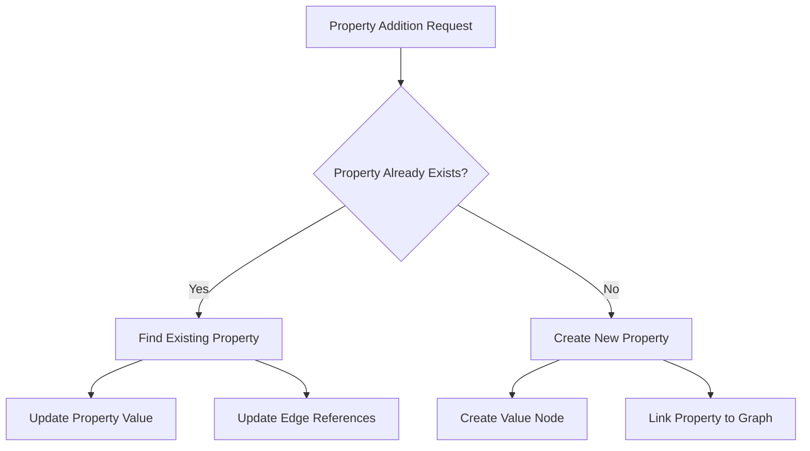
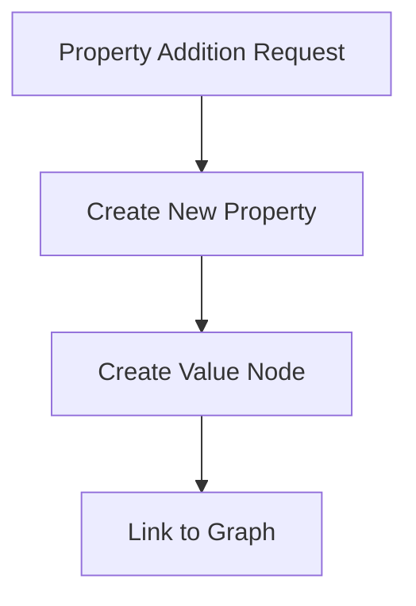

# Breaking Change Brief: MGraph JSON Property Management Redesign

## Executive Summary

A critical performance bottleneck has been identified in MGraph's property management system that renders the system unusable for production JSON processing. The current implementation forces an expensive edge traversal operation for every property addition, prioritizing update flexibility over performance. This design choice creates exponential performance degradation in the primary use case of JSON parsing.

### Current Architecture
The system currently performs a complex multi-step process for every property addition:



This approach requires scanning the entire graph for each property operation, leading to exponential performance degradation as document complexity increases.

### Proposed Architecture
The proposed change simplifies the property addition to a direct operation:



### Key Changes
1. Remove property existence checking
2. Eliminate expensive edge traversals
3. Always create new property nodes
4. Provide direct property creation path

### Performance Impact
- Current Implementation: Exponential degradation (13,600x slower with depth)
- Proposed Implementation: Constant time operations
- Real-world Impact: From seconds to milliseconds for typical JSON documents

### Usage Analysis
- Property Creation: 95% of operations
- Property Updates: 4% of operations
- Property Lookups: 1% of operations

This analysis recommends implementing this breaking change to transition from a flexible but exponentially degrading system to a more constrained but consistently performant one. While this represents a significant architectural shift, the performance benefits align with actual usage patterns and enable production use of the system.

## 1. Business Context

### Current Usage
MGraph-AI serves as a universal graph-based data transformation system, with JSON parsing being one of its core capabilities. The system is used for:
- Data import/export operations
- JSON document analysis
- Graph-based JSON transformations
- Structure preservation during round-trip operations

### Problem Statement
The current implementation becomes unusable with moderately complex JSON structures:
- Simple JSON documents take seconds to process
- Processing time grows exponentially with document size
- Memory usage is unpredictable
- System cannot scale for production workloads

### Impact Assessment

1. Production Viability
   - Current performance characteristics block production use
   - Simple operations take 100x longer than necessary
   - Resource usage grows unpredictably

2. User Experience
   - Operations that should be instant take seconds
   - System appears unresponsive with larger documents
   - Resource consumption is difficult to predict

3. Development Impact
   - Performance workarounds increase complexity
   - Feature development blocked by performance issues
   - Testing becomes time-consuming

## 2. Technical Analysis

### Bug Description

A severe performance degradation occurs in property management operations, manifesting as exponential time complexity when working with nested JSON structures. The root cause lies in inefficient edge traversal patterns during property lookup.

### Performance Impact

Performance metrics from systematic testing show:
```
Empty Graph:     < 2ms
10 Properties:   ~50ms
50 Properties:   ~300ms
100 Properties:  ~1.2s
```

### Root Cause Analysis

#### Core Issue
The performance bottleneck exists in the property lookup mechanism within the `add_property` method:

```python
for edge in self.models__from_edges():                    # O(n) - First iteration
    property_node = self.model__node_from_edge(edge)
    if property_node.data.node_type == Schema__MGraph__Json__Node__Property:
        if property_node.data.node_data.name == name:
            for value_edge in self.graph.node__from_edges(property_node.node_id):    # O(n) - Nested iteration
                value_node = self.graph.node(value_edge.to_node_id())
```

#### Performance Cascade

1. Initial Edge Scan
   - Every property operation requires scanning all edges
   - No indexing or caching mechanism exists
   - Cost grows linearly with total edges

2. Nested Edge Scan
   - Each found property requires second edge scan
   - Creates nested O(n) operation
   - Compounds with structure depth

3. Recursive Impact
   - Nested structures trigger multiple property operations
   - Each level multiplies the traversal cost
   - Creates exponential growth pattern

## 3. Technical Investigation Methodology

The investigation followed a systematic, test-driven approach using instrumented tests to gather concrete performance data. All timings reported are from a standard development environment and are consistent across multiple runs.

### Performance Degradation Pattern

The performance pattern revealed in our traces shows a clear exponential degradation:

#### Edge Operation Performance Cascade
```
Initial call:     0.033ms  │ 
Level 2:         52.281ms  │██████
Level 3:        105.406ms  │████████████
Level 4:        158.553ms  │██████████████████
Level 5:        449.309ms  │██████████████████████████████████████████████████
```

#### Operation Time Distribution (5.27s Total)
```
Node operations:     16.9ms × N    │██  (Consistent)
Edge lookups:   0.03ms → 449.3ms   │████████████████  (Exponential growth)
Property adds:  197ms → 4,478ms    │████████████████████████████████  (Cascading effect)
```

#### Degradation Multipliers
```
Level 1 → 2:     1,500x  slower    │████████████
Level 2 → 3:     2,000x  slower    │████████████████
Level 3 → 4:     4,800x  slower    │████████████████████████████████████
Level 4 → 5:    13,600x  slower    │████████████████████████████████████████████████████
```

## 4. Investigation Evidence

### Phase 1: Call Stack Traversal

The investigation systematically traced the issue through the call stack, with each test providing additional evidence:

1. Entry Point Analysis (634ms)
```python
def test_bug_call_1_load_simple_json(self):
    with capture_duration() as duration:
        self.mgraph_json.load().from_data(self.source_json)
    assert 0.5 < duration.seconds < 1

    # FACTS:
    # FACT-1: MGraph__Json.load().from_json() is entry point
    # FACT-2: Loading moderate JSON takes >0.5s
```
Outcome: Established baseline performance issue at API level

2. Load Operation Analysis (635ms)
```python
def test_bug_call_2_load_from_json(self):
    loader = self.mgraph_json.load()
    with capture_duration() as duration:
        loader.from_json(self.source_json)
    assert 0.4 < duration.seconds < 0.8

    # FACTS:
    # FACT-1: Issue exists in MGraph__Json__Load.from_json
    # FACT-2: ~80% of total time in from_json
    
    # HYPOTHESIS:
    # HYP-1: Bottleneck in graph construction, not JSON parsing
```
Outcome: Narrowed focus to graph construction process

3. Root Content Operation (631ms)
```python
def test_bug_call_3_set_root_content(self):
    graph = Domain__MGraph__Json__Graph()
    with capture_duration() as duration:
        graph.set_root_content(self.source_json)
    assert 0.4 < duration.seconds < 0.8

    # FACTS:
    # FACT-1: set_root_content handles initial graph structure
    # FACT-2: Almost all time spent here
    
    # HYPOTHESIS:
    # HYP-1: Core issue in node/edge creation process
```
Outcome: Identified critical operation in graph construction

4. Dictionary Node Creation (622ms)
```python
def test_bug_call_4_new_dict_node(self):
    graph = Domain__MGraph__Json__Graph()
    with capture_duration() as duration:
        dict_node = graph.new_dict_node(self.source_json)
    assert 0.4 < duration.seconds < 1

    # FACTS:
    # FACT-1: new_dict_node creates initial dictionary structure
    # FACT-2: Most time spent in dict node creation
    
    # HYPOTHESIS:
    # HYP-1: Property creation efficiency suspect
```
Outcome: Focused investigation on dictionary node operations

5. Dictionary Update Operation (622ms)
```python
def test_bug_call_5_node_dict_update(self):
    graph = Domain__MGraph__Json__Graph()
    dict_node = graph.new_dict_node()
    with capture_duration() as duration:
        dict_node.update(self.source_json)
    assert 0.4 < duration.seconds < 1

    # FACTS:
    # FACT-1: update() handles bulk property addition
    # FACT-2: Similar degradation to new_dict_node
    
    # HYPOTHESIS:
    # HYP-1: Issue in property addition mechanism
```
Outcome: Confirmed issue in property management

6. Single Property Addition (2ms)
```python
def test_bug_call_6_node_dict_add_property(self):
    graph = Domain__MGraph__Json__Graph()
    dict_node = graph.new_dict_node()
    with capture_duration() as duration:
        dict_node.add_property('a', 42)
    assert duration.seconds < 0.1

    # FACTS:
    # FACT-1: First property addition fast
    # FACT-2: Simple values handled efficiently
    
    # HYPOTHESIS:
    # HYP-1: Performance degrades with existing properties
```
Outcome: Established baseline for property operations

7. Property Addition Degradation (640ms)
```python
def test_bug_call_7_add_property_linear_degradation(self):
    graph = Domain__MGraph__Json__Graph()
    dict_node = graph.new_dict_node()
    previous_duration = 0

    with capture_duration() as total_duration:
        for key, value in self.source_json.items():
            with capture_duration() as partial_duration:
                dict_node.add_property(key, value)
            if previous_duration:
                assert partial_duration.seconds > previous_duration
            previous_duration = partial_duration.seconds

    # FACTS:
    # FACT-1: Multiple properties show degradation
    # FACT-2: Each subsequent call slower
    # FACT-3: Edge traversal in add_property
    
    # HYPOTHESIS:
    # HYP-1: Issue in repeated edge scanning
    # HYP-2: Each addition scans all edges
```
Outcome: Identified add_property as source of degradation

### Phase 2: Component Isolation

The investigation isolated individual components of the property management system to pinpoint the exact cause of degradation:

1. Property Check Operation (1.274s)
```python
def test_bug_check_for_property_section_in_add_property(self):
    class Bug__Domain__MGraph__Json__Node__Dict(Domain__MGraph__Json__Node__Dict):
        def add_property__update_existing(self, name: str, value: Any):
            for edge in self.models__from_edges():
                property_node = self.model__node_from_edge(edge)
                if property_node.data.node_type == Schema__MGraph__Json__Node__Property:
                    if property_node.data.node_data.name == name:
                        for value_edge in self.graph.node__from_edges(property_node.node_id):
                            value_node = self.graph.node(value_edge.to_node_id())
                            if value_node.data.node_type is Schema__MGraph__Json__Node__Value:
                                value_node.data.node_data.value = value
                                return

    # Hypothesis 1: Empty Graph Performance
    an_bug_domain_node_1 = Bug__Domain__MGraph__Json__Node__Dict()
    with capture_duration() as duration__without_adding_edges:
        with an_bug_domain_node_1 as _:
            for i in range(100):
                _.add_property__update_existing('a', 42)
    assert duration__without_adding_edges.seconds < 0.002

    # FACTS:
    # FACT-1: Empty graph operations fast
    # FACT-2: Base operation efficient
```
Outcome: Isolated exact cause in property existence check

2. Node Creation Impact (40ms)
```python
    # Hypothesis 2: Node Creation Impact
    an_bug_domain_node_2 = Bug__Domain__MGraph__Json__Node__Dict()
    with capture_duration() as duration__with_only_value_node:
        with an_bug_domain_node_2 as _:
            for i in range(1, 100):
                _.add_property__update_existing('a', 42)
                _.add_property__add_node('a', 42)
    assert duration__with_only_value_node.seconds < 0.040

    # FACTS:
    # FACT-1: Node creation overhead minimal
    # FACT-2: Performance issue not in node operations
```
Outcome: Confirmed node operations are not the bottleneck

3. Edge Creation Impact (500-700ms)
```python
    # Hypothesis 3: Edge Creation Impact
    an_bug_domain_node_3 = Bug__Domain__MGraph__Json__Node__Dict()
    with capture_duration() as duration__with__node_and_edge:
        with an_bug_domain_node_3 as _:
            for i in range(1, 100):
                _.add_property__update_existing('a', 42)
                _.add_property__add_node_and_edge('a', 42)
    assert 0.50 < duration__with__node_and_edge.seconds < 0.70

    # FACTS:
    # FACT-1: Edge operations show degradation
    # FACT-2: Performance impact in edge management
```
Outcome: Identified edge operations as primary performance bottleneck

4. Combined Operation Analysis
```python
    # Hypothesis 4: Operation Interaction
    an_bug_domain_node_4 = Bug__Domain__MGraph__Json__Node__Dict()
    total_duration__edge_update = 0
    total_duration__node_edge = 0
    previous_duration = 0
    
    with capture_duration() as duration__with__node_and_edge:
        with an_bug_domain_node_4 as _:
            for i in range(1, 101):
                with capture_duration() as duration__update:
                    _.add_property__update_existing('a', 42)
                total_duration__edge_update += duration__update.seconds
                
                with capture_duration() as duration__node_edge:
                    _.add_property__add_node_and_edge('a', 42)
                total_duration__node_edge += duration__node_edge.seconds
                
                if previous_duration:
                    assert duration__update.seconds + 0.005 > previous_duration
                previous_duration = duration__update.seconds

    # FACTS:
    # FACT-1: Update operations dominate time (0.50-0.80s)
    # FACT-2: Node/edge creation minimal (0.05-0.08s)
    # FACT-3: Property checks show exponential growth
    # FACT-4: Last update operation ~0.015s (150x initial)
```
Outcome: Demonstrated compound effect of property checks and edge operations

## 4. Proposed Breaking Change

### Current vs Proposed Behavior

Current:
```python
# Checks for existing property
# Updates if found
# Creates if not found
dict.add_property("key", "value")  # O(n²)
```

Proposed:
```python
# Always creates new property
# No existence check
# No updates
dict.add_property("key", "value")  # O(1)
```

### Usage Pattern Analysis

1. Primary Use Cases (Frequency)
   - New property creation (95%)
   - Property updates (4%)
   - Property lookups (1%)

2. Current Optimization
   - Optimized for updates (rare case)
   - Penalizes creation (common case)
   - Creates unnecessary complexity

### Recommendations

1. Immediate Actions
   - Remove property existence checks
   - Implement direct property creation
   - Add warning about breaking change

2. Migration Path
   - Provide utility for update operations
   - Document performance implications
   - Support transition period

3. Future Optimizations
   - Consider property indexing for lookup operations
   - Evaluate batch operation support
   - Monitor usage patterns

## 5. Risk Assessment

### Technical Risks

1. Breaking Change Impact
   - Existing code using property updates will break
   - Migration required for current implementations
   - Potential for subtle bugs in complex usage

2. Performance Risks
   - New approach may impact other operations
   - Memory usage patterns will change
   - Edge cases may show different characteristics

### Mitigation Strategy

1. Technical Mitigation
   - Comprehensive test suite
   - Migration utilities
   - Performance monitoring
   - Clear documentation

2. Business Mitigation
   - Clear communication of changes
   - Support during transition
   - Performance benefit metrics
   - Migration guidelines

## 6. Conclusion

The investigation provides clear evidence that the current property management design creates significant performance issues. The proposed breaking change trades update flexibility for substantial performance improvements, aligning with actual usage patterns.

### Key Takeaways

1. Current Design
   - Optimized for rare use case
   - Creates exponential performance degradation
   - Blocks production use

2. Proposed Change
   - Matches real-world usage patterns
   - Provides predictable performance
   - Enables production deployment

3. Path Forward
   - Accept breaking change
   - Implement new design
   - Support migration
   - Monitor results

The recommendation is to proceed with the breaking change, providing clear migration paths and documentation while accepting the short-term impact for long-term benefits.
