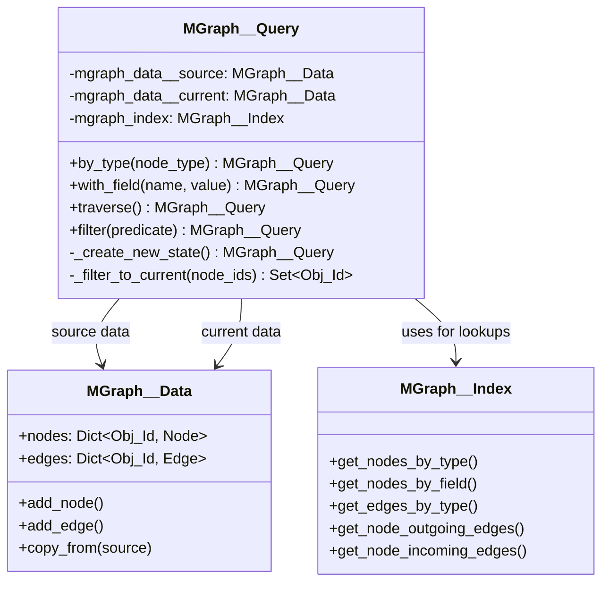
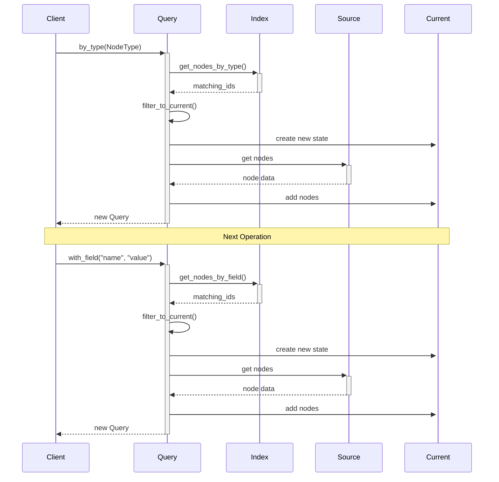

# MGraph Query  - Redesign Briefing #1

## Overview

This document outlines the redesign of the MGraph__Query component to improve state management and query operations while maintaining high performance and clear data lineage.

## Current Issues

The current implementation tracks state through multiple separate components:
```python
class MGraph__Query(Type_Safe):
    mgraph_index        : MGraph__Index
    mgraph_data         : MGraph__Data
    current_node_ids    : Set[Obj_Id]
    current_node_type   : Optional[str]
    current__filters    : List[Dict[str, Any]]
```

This approach has several limitations:
- Complex state management
- Unclear data lineage
- Redundant tracking of node types and filters
- Potential inconsistencies between states

## Proposed Architecture

### Core Components

The redesigned MGraph__Query will use three primary components:

```python
class MGraph__Query(Type_Safe):
    mgraph_data__source  : MGraph__Data     # Reference to original data
    mgraph_data__current : MGraph__Data     # Current query state
    mgraph_index         : MGraph__Index    # Reference to main index
```

### Architecture Diagrams

#### Class Structure


#### Operation Flow


### Key Design Principles

1. **Clear State Management**
   - Source data remains immutable
   - Each query operation produces new current state
   - Main index provides efficient lookups

2. **Single Source of Truth**
   - MGraph__Index handles all lookups
   - Current state contains complete subgraph
   - No redundant state tracking

3. **Efficient Operations**
   - O(1) lookups via index
   - Minimal data copying
   - Clear boundaries for garbage collection

## Operation Flow

### Query Execution Pattern

1. **Lookup Phase**
   - Use MGraph__Index for efficient node/edge finding
   - Leverage existing index structures
   - O(1) access to type and field-based queries

2. **Filter Phase**
   - Filter results to match current state
   - Maintain graph consistency
   - Preserve relationships between nodes

3. **State Creation**
   - Create new MGraph__Data instance
   - Copy relevant nodes and edges
   - Maintain complete subgraph

### Example Operations

#### By Type Query
```python
def by_type(self, node_type: Type[Schema__MGraph__Node]) -> 'MGraph__Query':
    # Get matching nodes from index
    matching_ids = self.mgraph_index.get_nodes_by_type(node_type)
    
    # Filter to current state
    current_ids = self._filter_to_current(matching_ids)
    
    # Create new query state
    return self._create_new_state(current_ids)
```

#### Field Query
```python
def with_field(self, field: str, value: Any) -> 'MGraph__Query':
    # Use index for lookup
    matching_ids = self.mgraph_index.get_nodes_by_field(field, value)
    
    # Filter to current state
    current_ids = self._filter_to_current(matching_ids)
    
    # Create new state
    return self._create_new_state(current_ids)
```

#### Traversal
```python
def traverse(self) -> 'MGraph__Query':
    result_ids = set()
    
    # Use index for edge lookup
    for node_id in self.mgraph_data__current.nodes:
        edges = self.mgraph_index.get_node_outgoing_edges(node_id)
        
        # Add connected nodes
        for edge_id in edges:
            edge = self.mgraph_data__source.edge(edge_id)
            result_ids.add(edge.to_node_id())
    
    return self._create_new_state(result_ids)
```

## Implementation Benefits

1. **Simplified Logic**
   - Clear operation flow
   - Predictable state changes
   - Easy to reason about behavior

2. **Improved Performance**
   - Efficient lookup operations
   - Minimal redundant data
   - Optimal memory usage

3. **Better Maintainability**
   - Clear separation of concerns
   - Consistent patterns
   - Easy to extend

4. **Enhanced Debugging**
   - Complete state at each step
   - Clear data lineage
   - Easy to inspect

## Conclusion

This redesign simplifies MGraph__Query while improving its capabilities and maintainability. The clear separation between source data, current state, and index operations provides a solid foundation for future enhancements while maintaining high performance and reliability.
