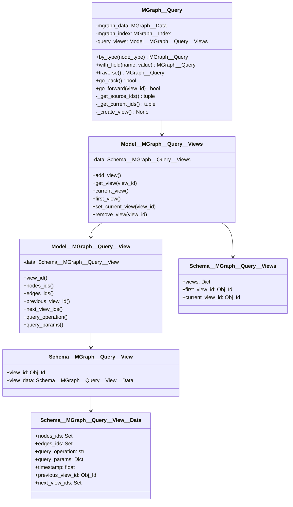
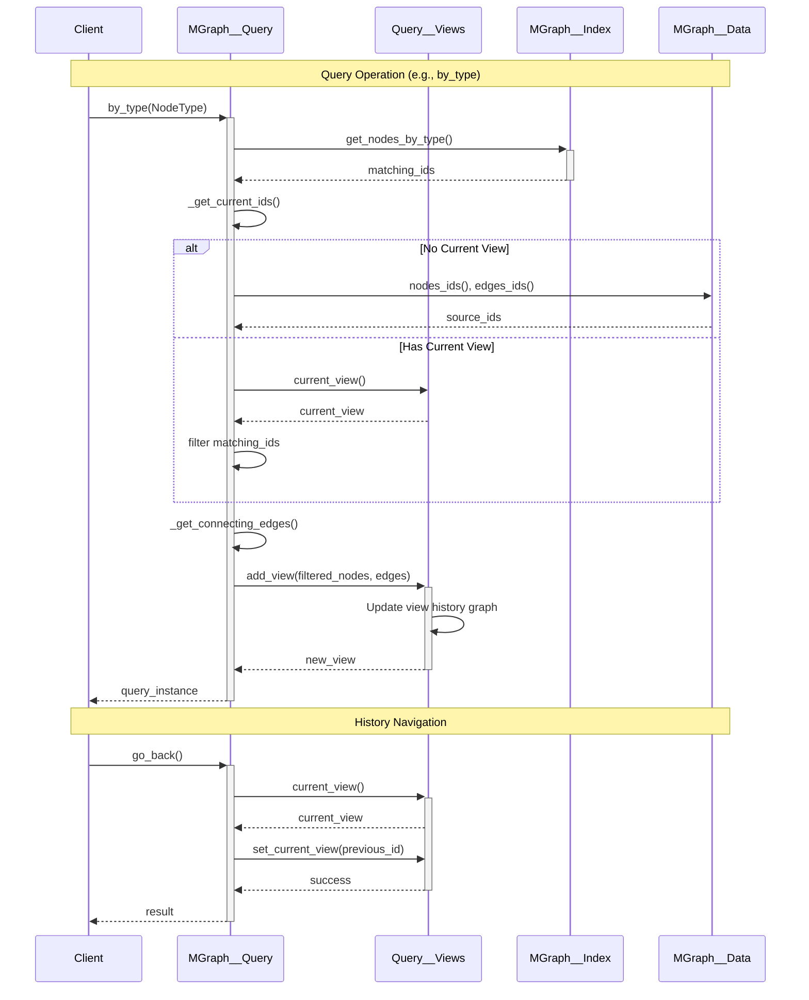

# MGraph Query - Redesign Briefing #2

## Introduction

The MGraph Query system has undergone significant architectural evolution to address limitations in the original implementation while introducing powerful new capabilities. This document outlines version 2 of the design, which transforms the query system from a simple state-tracking mechanism into a sophisticated view-based system with built-in history navigation.

### Previous Implementation

The original MGraph Query implementation tracked state through multiple separate components:

```python
class MGraph__Query(Type_Safe):
    mgraph_index        : MGraph__Index
    mgraph_data         : MGraph__Data
    current_node_ids    : Set[Obj_Id]
    current_node_type   : Optional[str]
    current__filters    : List[Dict[str, Any]]
```

This approach had several limitations:
- Complex state management across multiple fields
- Unclear data lineage between operations
- Redundant tracking of node types and filters
- No ability to navigate through query history
- Potential state inconsistencies
- Memory inefficiencies from redundant data

### Key Changes in Version 2

1. **View-Based Architecture**
   - Replaced direct state tracking with dedicated view objects
   - Each query operation creates a new view containing:
     - Matched nodes and their connecting edges
     - Operation metadata
     - Links to previous/next views
   - Clear separation between source data and query results

2. **Graph-Based History**
   - Query history maintained as a navigable graph
   - Views connected through previous/next relationships
   - Support for multiple query paths and branching
   - Ability to move forward/backward through query history

3. **Improved State Management**
   - Single source of truth through MGraph__Data
   - Clear data lineage between operations
   - Efficient handling of initial state
   - Better memory management

4. **Enhanced Query Operations**
   - Each operation maintains graph consistency
   - Automatic tracking of connecting edges
   - Support for operation metadata
   - Efficient index utilization

5. **Performance Optimizations**
   - Lazy initialization of views
   - Selective copying of graph elements
   - Efficient navigation between views
   - Support for view cleanup and reuse

These changes transform MGraph Query from a simple filtering mechanism into a powerful graph exploration tool that maintains complete history and enables complex query patterns while improving performance and maintainability.

## Architecture Diagrams

### Class Structure



### Operation Flow



## Core Architecture

### View-Based Query Model

The system implements a view-based approach where each query operation creates a view containing:
- Set of matching node IDs
- Set of connecting edge IDs
- Query operation metadata
- Links to previous/next views

Key design decisions from initial discussion:
1. No need to create new MGraph__Query for each operation
2. Store history as a graph with previous/next links
3. Special handling for initial state to avoid redundant copying
4. Clear separation between source data and current view

### Schema Layer

```python
class Schema__MGraph__Query__View__Data(Type_Safe):
    nodes_ids           : Set[Obj_Id]                  # Node IDs in this view
    edges_ids           : Set[Obj_Id]                  # Edge IDs in this view
    query_operation     : str                          # Type of query operation
    query_params        : Dict                         # Parameters used in query
    timestamp           : float                        # When view was created
    previous_view_id    : Optional[Obj_Id]            # Link to previous view
    next_view_ids       : Set[Obj_Id]                 # Links to next views (branches)

class Schema__MGraph__Query__View(Type_Safe):         # Schema for query view
    view_id            : Obj_Id                       # Unique view identifier
    view_data          : Schema__MGraph__Query__View__Data     # View data and metadata
    
class Schema__MGraph__Query__Views(Type_Safe):       # Container for all views
    views              : Dict[Obj_Id, Schema__MGraph__Query__View]   # Map of all views
    first_view_id      : Optional[Obj_Id]            # First view in history
    current_view_id    : Optional[Obj_Id]            # Current active view
```

### Model Layer

```python
class Model__MGraph__Query__View(Type_Safe):
    data: Schema__MGraph__Query__View

    def view_id(self) -> Obj_Id:
        return self.data.view_id

    def nodes_ids(self) -> Set[Obj_Id]:
        return self.data.view_data.nodes_ids

    def edges_ids(self) -> Set[Obj_Id]:
        return self.data.view_data.edges_ids

    def previous_view_id(self) -> Optional[Obj_Id]:
        return self.data.view_data.previous_view_id

    def next_view_ids(self) -> Set[Obj_Id]:
        return self.data.view_data.next_view_ids

class Model__MGraph__Query__Views(Type_Safe):
    data: Schema__MGraph__Query__Views

    def add_view(self, nodes_ids: Set[Obj_Id],
                      edges_ids: Set[Obj_Id],
                      operation: str,
                      params: Dict,
                      previous_id: Optional[Obj_Id] = None) -> Model__MGraph__Query__View:
        
        view_id = Obj_Id()
        view = Schema__MGraph__Query__View()
        
        view.view_id = view_id
        view.view_data.nodes_ids = nodes_ids
        view.view_data.edges_ids = edges_ids
        view.view_data.timestamp = time()
        view.view_data.query_operation = operation
        view.view_data.query_params = params
        view.view_data.previous_view_id = previous_id
        view.view_data.next_view_ids = set()

        if previous_id and previous_id in self.data.views:
            self.data.views[previous_id].view_data.next_view_ids.add(view_id)

        self.data.views[view_id] = view
        
        if not self.data.first_view_id:
            self.data.first_view_id = view_id
        self.data.current_view_id = view_id

        return Model__MGraph__Query__View(data=view)
```

### Query Implementation

```python
class MGraph__Query(Type_Safe):
    mgraph_data         : MGraph__Data
    mgraph_index        : MGraph__Index
    query_views         : Model__MGraph__Query__Views

    def _get_source_ids(self) -> tuple[Set[Obj_Id], Set[Obj_Id]]:
        return (set(self.mgraph_data.nodes_ids()),
                set(self.mgraph_data.edges_ids()))

    def _get_current_ids(self) -> tuple[Set[Obj_Id], Set[Obj_Id]]:
        current_view = self.query_views.current_view()
        if not current_view:
            return self._get_source_ids()
        return (current_view.nodes_ids(), current_view.edges_ids())

    def by_type(self, node_type: Type[Schema__MGraph__Node]) -> 'MGraph__Query':
        matching_ids = self.mgraph_index.get_nodes_by_type(node_type)
        current_nodes, current_edges = self._get_current_ids()
        
        filtered_nodes = matching_ids & current_nodes if current_nodes else matching_ids
        filtered_edges = self._get_connecting_edges(filtered_nodes)
        
        self._create_view(nodes_ids=filtered_nodes,
                         edges_ids=filtered_edges,
                         operation='by_type',
                         params={'type': node_type.__name__})
        return self

    def go_back(self) -> bool:
        current_view = self.query_views.current_view()
        if current_view and current_view.previous_view_id():
            return self.query_views.set_current_view(current_view.previous_view_id())
        return False

    def go_forward(self, view_id: Optional[Obj_Id] = None) -> bool:
        current_view = self.query_views.current_view()
        if not current_view:
            return False
            
        next_ids = current_view.next_view_ids()
        if not next_ids:
            return False
            
        if view_id:
            if view_id in next_ids:
                return self.query_views.set_current_view(view_id)
            return False
            
        return self.query_views.set_current_view(next(iter(next_ids)))
```

## Performance Considerations

### Memory Management

1. **View Lifecycle**
   - Views can be removed when no longer needed
   - Branch cleanup when paths are abandoned
   - Optional persistence for important views

2. **Lazy Loading**
   - Initial view creation deferred until needed
   - Edge computation only when required
   - Selective loading of view data

### Optimization Opportunities

1. **View Reuse**
   - Cache frequently accessed views
   - Share views across similar queries
   - Intelligent view pruning

2. **Index Utilization**
   - Leverage index for all lookups
   - Maintain index consistency
   - Optimize index access patterns

## Implementation Guidelines

1. **View Creation**
   - Always include connecting edges between nodes
   - Maintain full graph connectivity
   - Track operation metadata
   - Enable navigation

2. **History Management**
   - Support multiple branches
   - Allow path exploration
   - Maintain consistency
   - Enable cleanup

3. **Performance**
   - Use index for all lookups
   - Minimize data copying
   - Enable view reuse
   - Support cleanup

## Future Enhancements

1. **Query Analysis**
   - Track query patterns
   - Identify common paths
   - Optimize frequent operations

2. **Advanced Navigation**
   - Query path comparison
   - Branch merging
   - Path optimization

3. **View Management**
   - View persistence
   - View serialization
   - Remote view sharing

## Usage Examples

### Basic Query Chain

```python
result = (query.by_type(UserNode)
               .with_field('status', 'active')
               .traverse()
               .collect())
```

### History Navigation

```python
# Forward navigation
if query.with_field('type', 'A').exists():
    query.go_forward()  # To next branch
    
# Backward navigation
query.go_back()  # To previous state
```

### View Exploration

```python
# Create branch
view1 = query.by_type(NodeA)
view2 = query.with_field('x', 1)
query.go_back()
view3 = query.with_field('y', 2)
```

## Notes for Next Session

Key areas to discuss:
1. Implementation of view history as a graph
2. Optimization of view creation and management
3. Enhanced navigation capabilities
4. Testing strategies for complex query paths
5. Memory management and cleanup approaches