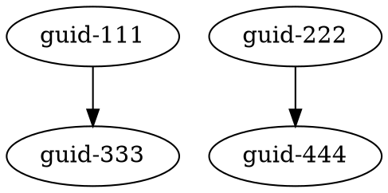

# MGraph: Project briefing on new MGraph core schema changes

_written in 12th Jan 2025_

## Introduction

This document outlines the refactoring project and breaking changes for current the MGraph core schema.

This project will refactor the current graph-based data representation and manipulation system into a much simpler model. 

Divided into three critical sections, it provides a deep dive into the motivations, strategies, and architectural 
transformation of our current graph data structure implementation.

### Part 1: Core Concept - Technical Analysis
The first section articulates the fundamental philosophical and technical principles underlying MGraph. 

It introduces the new graph structures, built on three core tenets:

- Nodes exist
- Edges connect nodes
- Everything else is implementation-specific

This section breaks down the minimalist approach that allows MGraph to become a universal foundation for representing 
connected data structures, pushing complexity to implementation layers while maintaining an incredibly simple core.

### Part 2: Pure Topology Representations
Building on the core concept, this section demonstrates the universal applicability of the MGraph approach by 
showcasing how a single graph topology can be represented across ten different formats, including:
- JSON
- XML
- RDF/Turtle
- CSV
- DOT Graph
- GraphML
- Neo4j Cypher
- N-Triples
- GEXF
- TGF

By illustrating how the same underlying structure can be expressed in radically different formats, this section 
underscores the power of MGraph's minimalist design.

### Part 3: Architectural Transformation

The final section provides a detailed analysis of the proposed architectural shift. It explores:

- The transition from a complex, type-safe implementation to a flexible, universal graph representation
- Strategies for maintaining extensibility while simplifying core structures
- A roadmap for implementation, including potential challenges and transformative benefits

Together, these three section provide a good example of the MGraph's refactoring strategy and the evolution of code 
that prioritizes simplicity, universality, and extensibility.

----
# Part 1 - MGraph Core Concept: Technical Analysis

## Executive Summary

MGraph's foundational principle rests on three core concepts: nodes exist, edges connect nodes, and everything else is implementation-specific. This minimalist approach creates a universal foundation for graph-based data representation and manipulation, where all complexity is pushed to the implementation layer.

## Core Principles of MGraph

• **Nodes exist**
  - A node is defined solely by its existence
  - No assumptions about what a node contains
  - No assumptions about node properties
  - No assumptions about node behavior
  - No assumptions about node identity (managed at Model/Domain level)

• **Edges connect nodes**
  - An edge only knows its source and target nodes
  - No assumptions about connection meaning
  - No assumptions about edge properties
  - No assumptions about edge directionality
  - No assumptions about edge identity (managed at Model/Domain level)

• **Everything else is implementation-specific**
  - All data storage is implementation-specific
  - All data validation is implementation-specific
  - All traversal logic is implementation-specific
  - All data transformation is implementation-specific
  - All identity management is implementation-specific
  - All serialization is implementation-specific
  - All business logic is implementation-specific

## Core Data Structure

At its most fundamental level, MGraph maintains only the pure topology of connected elements:

```python
class Schema__MGraph__Node:
    node_type: Type['Schema__MGraph__Node']    # Only type information needed

class Schema__MGraph__Edge:
    from_node_id: Random_Guid                  # References to connected nodes
    to_node_id: Random_Guid
    edge_type: Type['Schema__MGraph__Edge']

class Schema__MGraph__Graph:
    nodes: Dict[Random_Guid, Schema__MGraph__Node]   # Node identity in dict key
    edges: Dict[Random_Guid, Schema__MGraph__Edge]   # Edge identity in dict key
```

The serialized form reflects this minimal structure:

```json
{
    "nodes": {
        "123e4567": {},                     // Node exists, identity in key
        "234e5678": {},
        "345e6789": {}
    },
    "edges": {
        "456e7890": {                       // Edge exists, identity in key
            "from_node_id": "123e4567",     // References to nodes
            "to_node_id": "234e5678"
        },
        "567e8901": {
            "from_node_id": "123e4567",
            "to_node_id": "345e6789"
        }
    }
}
```

## Identity Management

A key insight of the design is that node and edge identities are managed through structure rather than content:

- Node identities exist as dictionary keys in the graph's nodes collection
- Edge identities exist as dictionary keys in the graph's edges collection
- The Schema layer has no awareness of these identities
- The Model layer provides access to these identities through behavior
- The Domain layer builds on this to provide business-specific identity management

This approach maintains a clean separation of concerns where:
- Schema layer knows only about structure
- Model layer knows about identity and behavior
- Domain layer knows about business meaning

## Core Operations

The fundamental operations possible with this structure are:

1. Node Existence: Add/remove entries in the nodes dictionary
2. Edge Creation: Add edges referencing existing nodes
3. Edge Removal: Remove edges from the edges dictionary
4. Graph Traversal: Follow edge references between nodes

These basic operations enable all higher-level functionality while maintaining zero assumptions about implementation details.

## Provider Implementation

While the core structure maintains only topology, providers can extend this to represent any connected data structure:

```python
# Example provider extension (implementation specific)
class Provider_Specific_Node(Schema__MGraph__Node):
    def __init__(self):
        self.format_specific = {}    # Provider adds its own data structure
```

The core makes no assumptions about:
- How providers store data
- How providers validate data
- How providers traverse data
- How providers transform data
- How providers serialize data

## Conclusion

The power of MGraph lies in its radical simplicity. By maintaining only the pure essence of a graph structure - nodes exist and edges connect them - it provides a universal foundation for representing and manipulating connected data structures. All complexity is deliberately pushed to the implementation layer, where providers can implement rich functionality while maintaining the simplicity of the core.


----

# Part 2 - Pure Topology Representations

## Core MGraph Structure
The fundamental structure only represents existence of nodes and connections between them:

```json
{
    "nodes": {
        "guid-111": {},
        "guid-222": {},
        "guid-333": {},
        "guid-444": {}
    },
    "edges": {
        "guid-555": {
            "from_node_id": "guid-111",
            "to_node_id": "guid-333"
        },
        "guid-666": {
            "from_node_id": "guid-222",
            "to_node_id": "guid-444"
        }
    }
}
```

## Same Topology in Different Formats

### 1. XML
```xml
<graph>
  <nodes>
    <node id="guid-111"/>
    <node id="guid-222"/>
    <node id="guid-333"/>
    <node id="guid-444"/>
  </nodes>
  <edges>
    <edge id="guid-555">
      <from>guid-111</from>
      <to>guid-333</to>
    </edge>
    <edge id="guid-666">
      <from>guid-222</from>
      <to>guid-444</to>
    </edge>
  </edges>
</graph>
```

### 2. JSON-LD
```json
{
  "@context": {
    "@vocab": "http://mgraph.org/",
    "from": "hasSource",
    "to": "hasTarget"
  },
  "@graph": [
    {"@id": "guid-111"},
    {"@id": "guid-222"},
    {"@id": "guid-333"},
    {"@id": "guid-444"},
    {
      "@id": "guid-555",
      "from": {"@id": "guid-111"},
      "to": {"@id": "guid-333"}
    },
    {
      "@id": "guid-666",
      "from": {"@id": "guid-222"},
      "to": {"@id": "guid-444"}
    }
  ]
}
```

### 3. RDF/Turtle
```turtle
@prefix mg: <http://mgraph.org/> .

mg:guid-111 a mg:Node .
mg:guid-222 a mg:Node .
mg:guid-333 a mg:Node .
mg:guid-444 a mg:Node .

mg:guid-555 mg:from mg:guid-111 ;
            mg:to   mg:guid-333 .

mg:guid-666 mg:from mg:guid-222 ;
            mg:to   mg:guid-444 .
```

### 4. CSV/Excel Format
Two sheets/files representing pure topology:

nodes.csv:
```csv
node_id
guid-111
guid-222
guid-333
guid-444
```

edges.csv:
```csv
edge_id,from_node_id,to_node_id
guid-555,guid-111,guid-333
guid-666,guid-222,guid-444
```

### 5. DOT Graph Format


### 6. GraphML
```xml
<?xml version="1.0" encoding="UTF-8"?>
<graphml xmlns="http://graphml.graphdrawing.org/xmlns">
  <graph id="G" edgedefault="directed">
    <node id="guid-111"/>
    <node id="guid-222"/>
    <node id="guid-333"/>
    <node id="guid-444"/>
    <edge id="guid-555" source="guid-111" target="guid-333"/>
    <edge id="guid-666" source="guid-222" target="guid-444"/>
  </graph>
</graphml>
```

### 7. Neo4j Cypher
```cypher
CREATE 
  (n111:Node {id: 'guid-111'}),
  (n222:Node {id: 'guid-222'}),
  (n333:Node {id: 'guid-333'}),
  (n444:Node {id: 'guid-444'}),
  (n111)-[r1:CONNECTS {id: 'guid-555'}]->(n333),
  (n222)-[r2:CONNECTS {id: 'guid-666'}]->(n444)
```

### 8. N-Triples (RDF)
```n-triples
<urn:guid-111> <urn:exists> "true" .
<urn:guid-222> <urn:exists> "true" .
<urn:guid-333> <urn:exists> "true" .
<urn:guid-444> <urn:exists> "true" .
<urn:guid-555> <urn:from> <urn:guid-111> .
<urn:guid-555> <urn:to> <urn:guid-333> .
<urn:guid-666> <urn:from> <urn:guid-222> .
<urn:guid-666> <urn:to> <urn:guid-444> .
```

### 9. GEXF (Graph Exchange XML Format)
```xml
<?xml version="1.0" encoding="UTF-8"?>
<gexf xmlns="http://www.gexf.net/1.2draft" version="1.2">
  <graph defaultedgetype="directed">
    <nodes>
      <node id="guid-111"/>
      <node id="guid-222"/>
      <node id="guid-333"/>
      <node id="guid-444"/>
    </nodes>
    <edges>
      <edge id="guid-555" source="guid-111" target="guid-333"/>
      <edge id="guid-666" source="guid-222" target="guid-444"/>
    </edges>
  </graph>
</gexf>
```

### 10. TGF (Trivial Graph Format)
```
# Nodes
guid-111
guid-222
guid-333
guid-444
#
guid-111 guid-333 guid-555
guid-222 guid-444 guid-666
```

## Key Points

1. Only Two Concepts:
   - Node existence (represented by GUIDs)
   - Edge connections (pairs of node GUIDs)

2. No Additional Data:
   - No node properties
   - No edge properties
   - No metadata
   - No types
   - No labels

3. Pure Topology:
   - Only captures what exists and what connects to what
   - Every format represents exactly the same structure
   - No semantic meaning in core structure


---- 

# Part 3 - MGraph Architectural Transformation

## Executive Summary

This document outlines a proposed architectural transformation for the MGraph system, focusing on creating a more universal, 
minimalist graph representation while maintaining critical implementation flexibility.

## Key Architectural Differences

### 1. Minimalist Core Philosophy

#### Existing Architecture
- Rich schema definitions with multiple properties
- Comprehensive type checking and validation
- Explicit attributes for nodes, edges, and graphs

#### Proposed Core Concept
- Extreme minimalism in core structure
- Nodes and edges exist primarily through identity
- Minimal assumptions about graph properties
- Pure topology representation with extensibility

#### Impact
- Simplified core data model
- Universal graph representation capabilities
- Increased flexibility across different domains

### 2. Structural Representation

#### Current Implementation
```python
class Schema__MGraph__Node:
    attributes: Dict[Random_Guid, Schema__MGraph__Attribute]
    node_data: Schema__MGraph__Node__Data
    node_type: Type[Schema__MGraph__Node]
```

#### Proposed Core Structure (with Refinement)
```python
class Schema__MGraph__Node:
    node_data: Schema__MGraph__Node__Data  # Preserved for implementation-specific data
    node_type: Type[Schema__MGraph__Node]  # Type information
```

#### Key Modification
- Retain `node_data` as an extensible container
- Remove assumptions about attributes
- Keep type information
- Allow providers to define their own `Node__Data` structure

### 3. Identity Management

#### Existing Approach
- Identities managed across Schema, Model, and Domain layers
- Complex identity-related behaviors

#### Proposed Concept
- Identities exist primarily as dictionary keys
- Schema layer minimally aware of identity
- Identity management delegated to Model and Domain layers

#### Benefits
- Clearer separation of concerns
- More flexible identity handling
- Reduced complexity in schema layer

### 4. Provider Extensibility

#### New Approach
```python
class Provider_Specific_Node(Schema__MGraph__Node):
    node_data: Provider_Specific_Node__Data  # Fully extensible

class Provider_Specific_Node__Data(Schema__MGraph__Node__Data):
    # Provider can add any additional fields or methods
    specific_metadata: Dict = {}
    custom_validation_rules: List = []
```

### 5. Multi-Format Representation

#### Core Principles
- Identical topology representation across formats
- No format-specific semantics in core structure
- Universal graph serialization

#### Supported Formats
- JSON
- XML
- RDF/Turtle
- CSV/Excel
- DOT Graph
- GraphML
- Neo4j Cypher
- N-Triples
- GEXF
- TGF

## Architectural Shifts

### 1. Simplified Layer Responsibilities

- **Schema Layer**: 
  - Pure structural representation
  - Minimal type information
  - Extensible data container

- **Model Layer**: 
  - Manage identity
  - Provide basic behavioral methods
  - Implement core graph operations

- **Domain Layer**: 
  - Define business semantics
  - Implement domain-specific logic
  - Add high-level interpretations

## Transformative Benefits

1. **Extreme Flexibility**
   - No preconceived notions about graph contents
   - Providers can implement any graph semantics
   - Minimal constraints on data representation

2. **Cross-Domain Compatibility**
   - Universal core structure
   - Trivial conversion between formats
   - Support for diverse graph types

3. **Minimal Implementation Overhead**
   - Reduced complexity in core layers
   - Push complexity to provider-specific implementations

## Transition Strategy

1. Implement minimalist core structure
2. Create base provider implementations
3. Develop format conversion utilities
4. Gradually migrate existing schemas
5. Maintain backwards compatibility

## Potential Challenges

1. Reduced compile-time type safety
2. Increased responsibility for provider implementations
3. Requires disciplined design in domain-specific layers

## Conclusion

This architectural transformation represents a paradigm shift from a strictly typed, constrained graph implementation to a universal, minimalist graph representation. By defining a graph as "nodes exist, edges connect nodes" with an extensible data container, we create a profoundly flexible system capable of representing any connected information structure.

The core innovation is the balance between extreme simplicity and unlimited extensibility, achieved by:
- Minimizing core assumptions
- Providing an open, extensible data container
- Maintaining clear layer responsibilities

