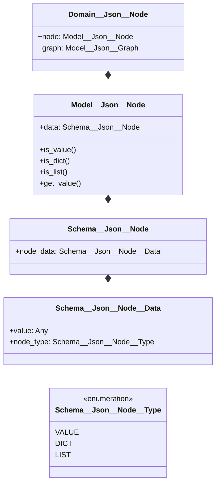
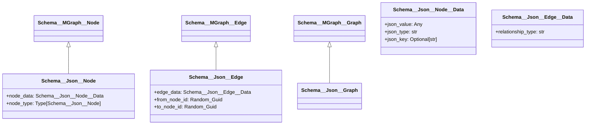

### Dev Task 1 - MGraph JSON Provider Technical Specification

This document captures the development of the technical specification for the MGraph JSON Provider, created in collaboration with Claude 3.5
and organized in three parts:

- **Part 1** - The Final Brief contains the current technical specification that we arrived at. This represents our simplified, graph-native approach that emerged through our discussions.
- **Part 2** - The Initial Design shows Claude's first solution. While comprehensive and solid, it followed more traditional patterns and had more complexity than needed.
- **Part 3** - The Design Journey documents our collaboration, including key questions, insights, and how we arrived at the simpler design.

This project shows the value of thorough design work before implementation, but it also highlights an interesting shift that GenAI brings to technical documentation. In traditional development, documentation often becomes tech debt because updating it is seen as costly and time-consuming. Authors resist changes not based on whether they're right, but on how much work they'll create.

With GenAI assistance, this friction disappears. Updating documentation becomes as natural as the design discussion itself. The focus stays where it should be: on finding the right solution, not managing documentation overhead.

The result? A simpler, cleaner design that emerged through genuine architectural exploration, unhampered by documentation maintenance concerns.

----- 
# Part 1 - MGraph JSON Provider Technical Specification

## Overview

The JSON Provider will enable MGraph to ingest, manipulate, and export JSON data structures using MGraph's core graph capabilities. This document outlines the technical approach, architecture, and implementation details.

## Core Concept: A Graph-Native Approach

The JSON Provider implements a pure graph-native approach to JSON representation, where every single JSON element becomes a node in its own right. This aligns perfectly with graph thinking and MGraph's core principles.

Key Principles:
- Every JSON element (value, object, array) is a node
- Structure is maintained purely through edges
- No special property nodes or complex containers needed
- Natural graph traversal and transformation
- Maximum simplicity and flexibility

## Architecture

### Three-Layer Architecture

Following MGraph's architectural principles, the implementation is divided into three clean layers:



Each layer has clear responsibilities:
- **Schema Layer**: Pure data structures and type definitions
- **Model Layer**: Operations on single entities
- **Domain Layer**: High-level JSON operations and business logic

### Node Types

The system recognizes three fundamental node types:

```python
class Schema__Json__Node__Type(Enum):
    VALUE = "value"    # Primitive values (str, int, bool, None)
    DICT  = "dict"     # JSON objects {}
    LIST  = "list"     # JSON arrays []

class Schema__Json__Node__Data(Type_Safe):
    value    : Any                           # The actual value for VALUE nodes
    node_type: Schema__Json__Node__Type      # Type of this node
```

This minimal structure captures all possible JSON structures while maintaining pure graph principles. Each node is self-contained and requires no special handling or complex containers.

## JSON to Graph Mapping

In our graph-native approach, every JSON element becomes a node, creating a pure graph structure. 

### Examples

1. **Simple Object**:
   ```json
   {
     "name": "John"
   }
   ```
   Becomes three nodes:
   ```
   [DICT node] --> [VALUE node: "name"] --> [VALUE node: "John"]
   ```

2. **Array**:
   ```json
   ["a", "b"]
   ```
   Becomes three nodes:
   ```
   [LIST node] --> [VALUE node: "a"]
                   [VALUE node: "b"]
   ```
   Edge order preserves array ordering.

3. **Nested Structures**:
   ```json
   {
     "user": {
       "details": {
         "age": 30
       }
     }
   }
   ```
   Becomes:
   ```
   [root] --has_property--> [user] --has_property--> [details] --has_property--> [age: 30]
   ```

### Node and Edge Patterns

The system uses a minimal set of concepts:

**Node Types:**
| Type  | Purpose | Contains |
|-------|---------|----------|
| VALUE | Represents any JSON value | The actual value (string, number, bool, null) |
| DICT  | Represents JSON objects | Nothing (structure through edges) |
| LIST  | Represents JSON arrays | Nothing (structure through edges) |

**Edge Usage:**
- Edges maintain structure and order
- No special edge types needed
- Array order preserved through edge metadata
- Object property names stored in VALUE nodes

## Implementation Details

### 1. Core Classes

```python
class MGraph__Json:
    """Main provider class for JSON operations"""
    
    def load(self, json_data: Union[str, dict]) -> Domain__Json__Graph:
        """Load JSON data into graph structure"""
        
    def export(self, format: str = 'json') -> Union[dict, str]:
        """Export graph to specified format"""

class Schema__Json__Node__Data:
    """Extended node data for JSON values"""
    json_value: Any
    json_type: str
    json_key: Optional[str]

class Domain__Json__Graph(Domain__MGraph__Graph):
    """Domain-specific graph operations for JSON"""
    
    def query_json_path(self, path: str) -> Any:
        """Query graph using JSON path syntax"""
```

### 2. Key Operations

#### Loading JSON
1. Parse JSON input
2. Create root node
3. Recursively process structure
4. Create nodes for values
5. Create edges for relationships

```python
def _process_json(self, data: Any, parent_node: Schema__Json__Node) -> None:
    if isinstance(data, dict):
        self._process_object(data, parent_node)
    elif isinstance(data, list):
        self._process_array(data, parent_node)
    else:
        self._process_primitive(data, parent_node)
```

#### Exporting JSON
1. Start from root node
2. Recursively rebuild structure
3. Handle circular references
4. Generate output format

### 3. Special Cases

| Case | Handling Strategy |
|------|------------------|
| Circular References | Track visited nodes, create reference edges |
| Large Arrays | Lazy loading for arrays over threshold size |
| Deep Nesting | Implement depth limit with warning |
| Schema Validation | Optional JSON Schema validation during load |

## Usage Examples

### Basic Usage
```python
# Create provider
json_provider = MGraph__Json()

# Load JSON
with open('data.json') as f:
    graph = json_provider.load(f.read())

# Manipulate
with graph.edit() as edit:
    node = edit.query_json_path('$.users[0].name')
    node.set_value('New Name')

# Export
result = json_provider.export()
```

### Advanced Features
```python
# Query with JSON Path
users = graph.query_json_path('$.users[*].name')

# Export to different format
rdf = json_provider.export(format='rdf')
xml = json_provider.export(format='xml')
```

## Implementation Phases

1. **Phase 1: Core Implementation**
   - Basic JSON loading
   - Simple object/array handling
   - Primitive value support
   - JSON export

2. **Phase 2: Advanced Features**
   - JSON Path queries
   - Circular reference handling
   - Performance optimizations
   - Large dataset support

3. **Phase 3: Format Support**
   - RDF export
   - XML export
   - Other format support

## Testing Strategy

1. **Unit Tests**
   - Individual component testing
   - Edge case validation
   - Type conversion verification

2. **Integration Tests**
   - End-to-end workflows
   - Format conversion accuracy
   - Performance benchmarks

3. **Validation Tests**
   - JSON Schema compliance
   - Circular reference handling
   - Deep nesting scenarios

## Success Criteria

1. **Functionality**
   - Accurate JSON representation
   - Lossless round-trip conversion
   - Efficient graph operations

2. **Performance**
   - Linear time complexity for basic operations
   - Efficient memory usage
   - Scalable with large datasets

3. **Usability**
   - Simple, intuitive API
   - Clear error messages
   - Comprehensive documentation

## Next Steps

1. Implement Schema__Json__Node__Data
2. Create basic JSON loading functionality
3. Implement graph to JSON export
4. Add JSON Path query support
5. Develop format conversion capabilities


--- 

# Part 2 - MGraph JSON Provider Technical Specification

## Overview

The JSON Provider will enable MGraph to ingest, manipulate, and export JSON data structures using MGraph's core graph capabilities. This document outlines the technical approach, architecture, and implementation details.

## Core Concept

The JSON Provider will map JSON structures to MGraph's graph representation:
- JSON objects/arrays become nodes
- Object properties/array elements become child nodes
- Relationships between objects become edges

## Architecture

### Class Hierarchy



### Data Structure

The JSON Provider will store data in the following format:

```python
class Schema__Json__Node__Data(Schema__MGraph__Node__Data):
    json_value: Any              # Actual value for primitives
    json_type: str              # "object", "array", "string", "number", "boolean", "null"
    json_key: Optional[str]     # Property name if node represents an object property
```

## JSON to Graph Mapping

### Basic Rules

1. **Objects**:
   ```json
   {
     "name": "John",
     "age": 30
   }
   ```
   Becomes:
   ```
   [root node] --has_property--> [name node: "John"]
                --has_property--> [age node: 30]
   ```

2. **Arrays**:
   ```json
   ["a", "b", "c"]
   ```
   Becomes:
   ```
   [array node] --array_element[0]--> [value node: "a"]
                --array_element[1]--> [value node: "b"]
                --array_element[2]--> [value node: "c"]
   ```

3. **Nested Structures**:
   ```json
   {
     "user": {
       "details": {
         "age": 30
       }
     }
   }
   ```
   Becomes:
   ```
   [root] --has_property--> [user] --has_property--> [details] --has_property--> [age: 30]
   ```

### Edge Types

| Relationship | Description | Example |
|-------------|-------------|---------|
| has_property | Connects object to its properties | object → property |
| array_element | Connects array to its elements | array → element |
| reference | Represents JSON references | node → referenced node |

## Implementation Details

### 1. Core Classes

```python
class MGraph__Json:
    """Main provider class for JSON operations"""
    
    def load(self, json_data: Union[str, dict]) -> Domain__Json__Graph:
        """Load JSON data into graph structure"""
        
    def export(self, format: str = 'json') -> Union[dict, str]:
        """Export graph to specified format"""

class Schema__Json__Node__Data:
    """Extended node data for JSON values"""
    json_value: Any
    json_type: str
    json_key: Optional[str]

class Domain__Json__Graph(Domain__MGraph__Graph):
    """Domain-specific graph operations for JSON"""
    
    def query_json_path(self, path: str) -> Any:
        """Query graph using JSON path syntax"""
```

### 2. Key Operations

#### Loading JSON
1. Parse JSON input
2. Create root node
3. Recursively process structure
4. Create nodes for values
5. Create edges for relationships

```python
def _process_json(self, data: Any, parent_node: Schema__Json__Node) -> None:
    if isinstance(data, dict):
        self._process_object(data, parent_node)
    elif isinstance(data, list):
        self._process_array(data, parent_node)
    else:
        self._process_primitive(data, parent_node)
```

#### Exporting JSON
1. Start from root node
2. Recursively rebuild structure
3. Handle circular references
4. Generate output format

### 3. Special Cases

| Case | Handling Strategy |
|------|------------------|
| Circular References | Track visited nodes, create reference edges |
| Large Arrays | Lazy loading for arrays over threshold size |
| Deep Nesting | Implement depth limit with warning |
| Schema Validation | Optional JSON Schema validation during load |

## Usage Examples

### Basic Usage
```python
# Create provider
json_provider = MGraph__Json()

# Load JSON
with open('data.json') as f:
    graph = json_provider.load(f.read())

# Manipulate
with graph.edit() as edit:
    node = edit.query_json_path('$.users[0].name')
    node.set_value('New Name')

# Export
result = json_provider.export()
```

### Advanced Features
```python
# Query with JSON Path
users = graph.query_json_path('$.users[*].name')

# Export to different format
rdf = json_provider.export(format='rdf')
xml = json_provider.export(format='xml')
```

## Implementation Phases

1. **Phase 1: Core Implementation**
   - Basic JSON loading
   - Simple object/array handling
   - Primitive value support
   - JSON export

2. **Phase 2: Advanced Features**
   - JSON Path queries
   - Circular reference handling
   - Performance optimizations
   - Large dataset support

3. **Phase 3: Format Support**
   - RDF export
   - XML export
   - Other format support

## Testing Strategy

1. **Unit Tests**
   - Individual component testing
   - Edge case validation
   - Type conversion verification

2. **Integration Tests**
   - End-to-end workflows
   - Format conversion accuracy
   - Performance benchmarks

3. **Validation Tests**
   - JSON Schema compliance
   - Circular reference handling
   - Deep nesting scenarios

## Success Criteria

1. **Functionality**
   - Accurate JSON representation
   - Lossless round-trip conversion
   - Efficient graph operations

2. **Performance**
   - Linear time complexity for basic operations
   - Efficient memory usage
   - Scalable with large datasets

3. **Usability**
   - Simple, intuitive API
   - Clear error messages
   - Comprehensive documentation

## Next Steps

1. Implement Schema__Json__Node__Data
2. Create basic JSON loading functionality
3. Implement graph to JSON export
4. Add JSON Path query support
5. Develop format conversion capabilities


---

# Part 3 - AI-Assisted Software Architecture: A Case Study

Here's an interesting example of using Claude 3.5 for software architecture design. The session showed some practical benefits of using AI as a design partner during the early stages of technical planning.

## The Challenge

I presented Claude with a specific challenge: design a JSON provider for our MGraph project - a universal graph-based data transformation and manipulation system. The goal was to create a provider that could load JSON files, convert them into MGraph objects, and enable manipulation using MGraph's native capabilities.

## Initial Design Proposal

Claude came back with a comprehensive technical specification that included:
- A detailed class hierarchy
- JSON-to-graph mapping rules
- Implementation details
- Testing strategies

The initial design was solid and followed common patterns for handling JSON structures, treating objects and arrays as containers and using special edge types for properties.

## The Evolution

The design started evolving when I asked:

> "So there are 3 types of 'nodes' right? - value, list, dict?"

While discussing these core types, I suggested an alternative approach:

> "What if we (since this is a raw dataset) actually treated each value as a node? i.e. { "a": "b" } is actually two nodes and one edge"

This led to a simpler approach that better aligned with graph principles:
- Every JSON element becomes a node in its own right
- Structure is maintained purely through edges
- No need for special property nodes or complex containers
- More aligned with graph-thinking
- Easier to traverse and transform

## The Refinement

The design rapidly evolved into a much cleaner, graph-native approach with just three node types:
```python
class Schema__Json__Node__Type(Enum):
    VALUE = "value"    # Primitive values (str, int, bool, None)
    DICT  = "dict"     # JSON objects {}
    LIST  = "list"     # JSON arrays []
```

This simplification made the entire system more elegant and true to graph principles. Every JSON element, whether a key, value, object, or array, became a first-class node in the graph.

## Clean Architecture

The final design cleanly separated concerns across three layers:

1. **Schema Layer**: Pure data structures
   - Node types and data containers
   - Minimal, focused responsibilities

2. **Model Layer**: Operations on single entities
   - Node and edge operations
   - Type validations

3. **Domain Layer**: Business logic
   - JSON-specific operations
   - High-level functionality

## Key Points

The session highlighted some useful aspects of AI-assisted design:

1. **Quick Iteration**: Moving from concept to refined architecture in one session
2. **Design Evolution**: Starting with a standard approach, then simplifying through discussion
3. **Documentation**: Maintaining clear technical documentation throughout the process
4. **Collaborative Refinement**: Combining human architectural insight with AI's ability to quickly adapt and document changes

## Conclusion

The end result was a simpler and more maintainable design than the initial proposal. This type of AI collaboration can be particularly useful in the early stages of architecture design, helping to rapidly prototype and refine ideas while maintaining clear documentation.


